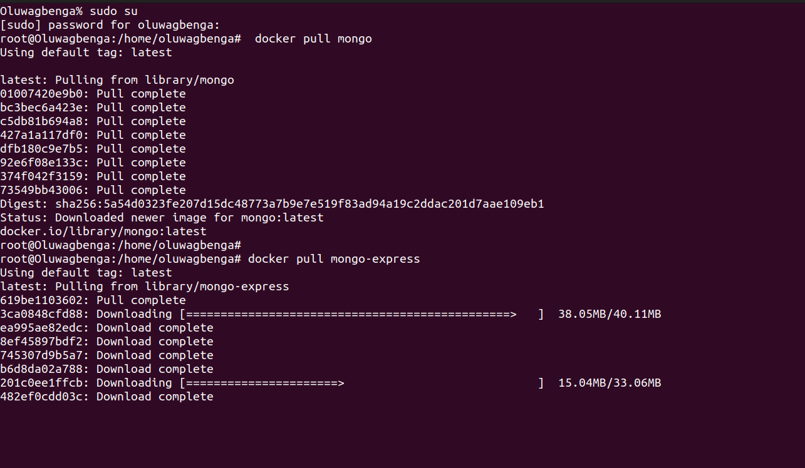
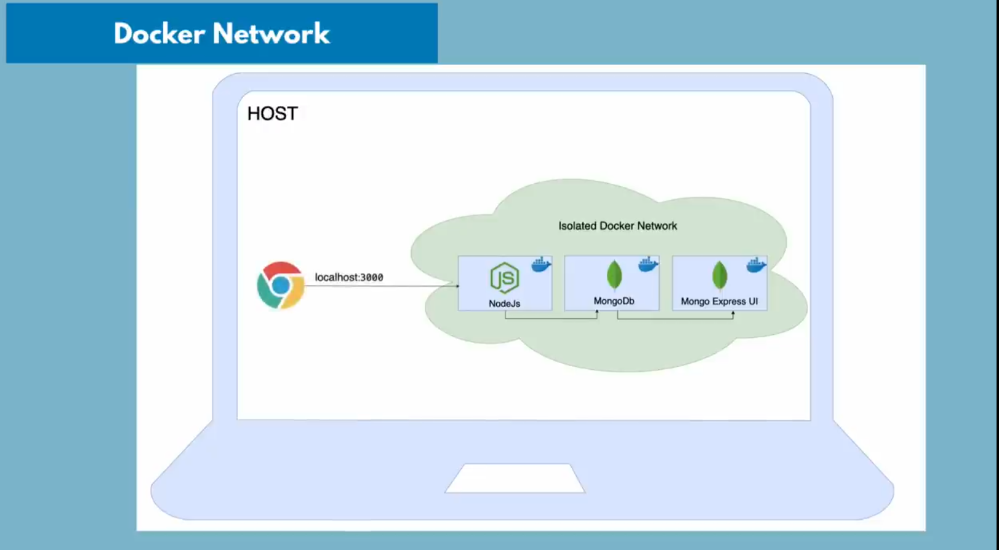
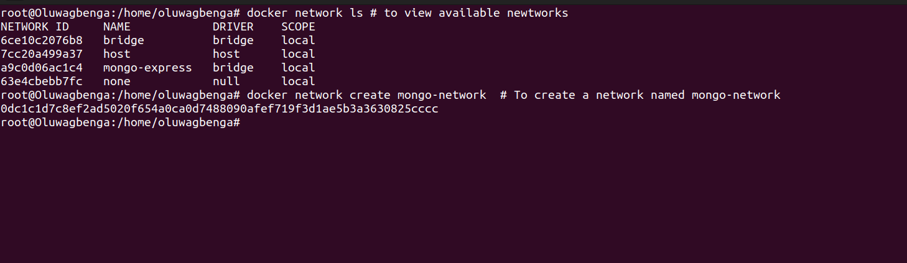
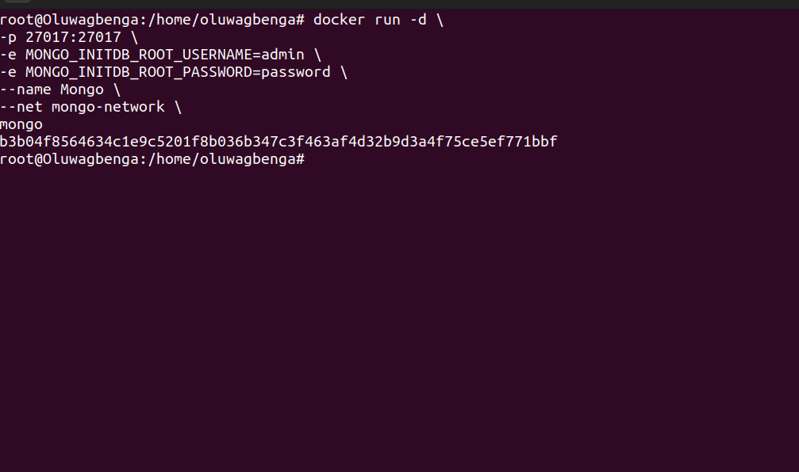
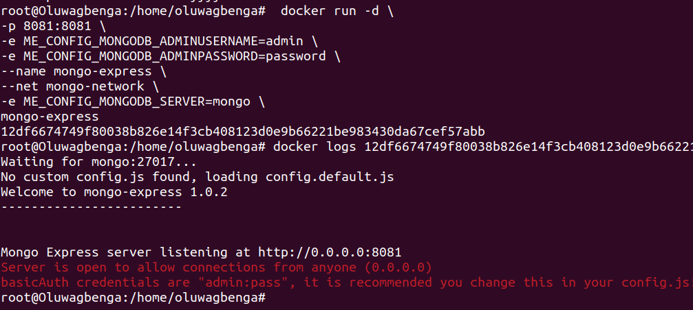
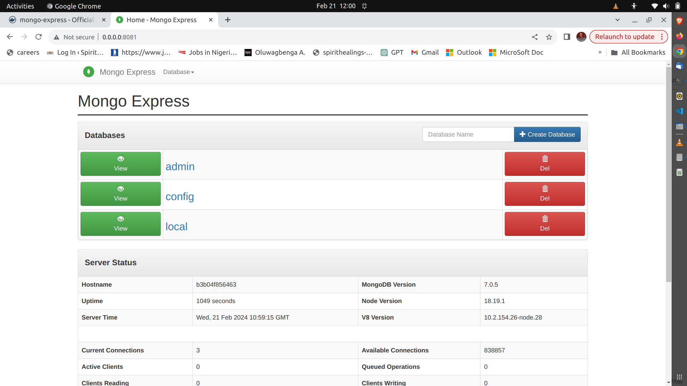

We start by pulling MongoDB  and Mogo-express images
```
docker pull mongo
docker pull mongo-express
```


Next, we have to run both mongoDB and Mongo-Express container. Before then we have to understand thr concept of `Docker Network`, Wwhich we will use to establish connection between the two containers.

### Docker Network
Docker networking enables containers to interact with each other and with external resources, facilitating the development and deployment of complex distributed applications. 

Containers in an isolated docker network talk to eachother through `Container's Name` and applications outside the network like the JavaScript
application in this case we communication with the application in the network via `localhost:port-number`



To create docker network for our application

```
docker network ls # to view available newtworks
docker network create mongo-network  # To create a network named mongo-network
```


To make both mongDB and Mongo-Express containers run in the network we created, we have to specify the network in which they will run and work. 

```
docker run -d \
-p 27017:27017 \
-e MONGO_INITDB_ROOT_USERNAME=admin \
-e MONGO_INITDB_ROOT_PASSWORD=password \
--name Mongo \
--net mongo-network \
mongo
```
 

Now, we go ahead and rund the mongo-express as well
```
docker run -d \
-p 8081:8081 \
-e ME_CONFIG_MONGODB_ADMINUSERNAME=admin \
-e ME_CONFIG_MONGODB_ADMINPASSWORD=password \
--name mongo-express \
--net mongo-network \
-e ME_CONFIG_MONGODB_SERVER=mongo \
mongo-express
```


Afterward, open up the Mongo-Express dashboard on a browser with ths url `http://0.0.0.0:8081/`, use `admin` as username and `pass` as the password

 

From the mongo-express interface, create a database with the name `user-account`

### NodeJS
Lastly, setup your nodeJS server, and access the application on `http://0.0.0.0:3000`

