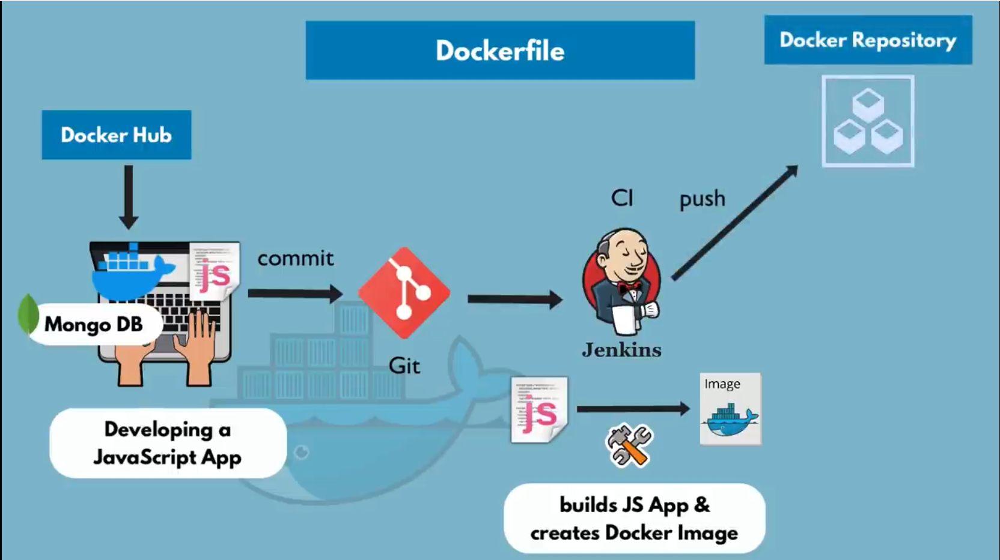
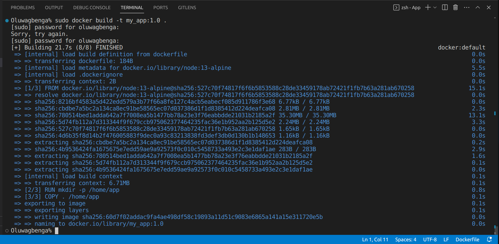

### Dckerfile

A Dockerfile is a text file that contains instructions for building a Docker image. Docker is a platform that enables developers to package their applications and dependencies into lightweight containers, which can then be easily shared and run consistently across different environments.

A Dockerfile typically includes a series of commands that specify how to assemble the image layer by layer. These commands can include instructions such as copying files into the image, installing software dependencies, setting environment variables, and defining the entry point for the container.

Once a Dockerfile is created, you can use the docker build command to build an image from it. This process creates a reusable artifact that encapsulates your application and its dependencies, making it easy to deploy and run in various environments.



We're going to build a docker image of out Javascript application, and deploy it iy into docker repository.
Here's a simple syntax of dockerfile
```
# install node image or use an existing node image.
FROM node 

# declaring envirnoment variables in dockerfiles.
ENV MONGO_DB_USERNAME=admin \
    MONGO_DB_PWD=password

# This is to create "app" directory and create parent directory if not existing.
RUN mkdir -p /home/app

# This is a docker command which copy all current host folder files into the container.
COPY . /home/app

# This will start the app with "node server.js"
CMD ["node", "server.js"]
```
After the dockerfile is completely written ans saved, next we assign a name and tag/version
```
docker build -t my_app:1.0 .
```
